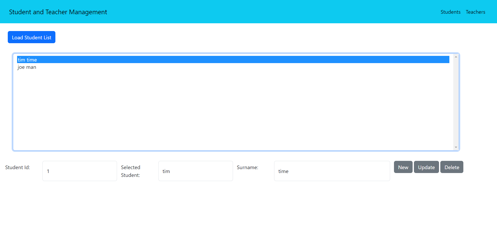
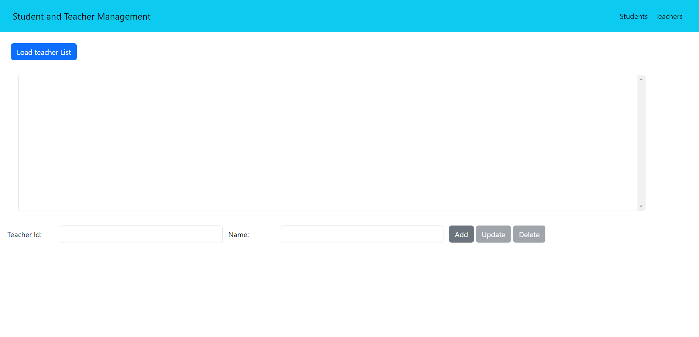

# Student Teacher Mgmt System

A Web application to create, update, read and delete students and teachers

## Table of Contents

- [Introduction](#introduction)
- [Features](#features)
- [Getting Started](#getting-started)
  - [Prerequisites](#prerequisites)
  - [Installation](#installation)
- [Usage](#usage)
- [Contributing](#contributing)
- [License](#license)

## Introduction

The Student Teacher management system is a REST web application that allows creation, reading, update and deletion of students and teachers. The technologies used are Spring Data, Spring REST, jQuery. This Project also includes unit tests.

## Features

List the main features of your Spring Boot application. Highlight the functionalities that make it stand out or unique.

## Getting Started

### Prerequisites

Before running this project, ensure you have the following installed:

- Java Development Kit (JDK) 11 or later
- Maven
- MySQL (or any other supported database)

### Installation

1. Clone the repository:

   ```shell
   git clone https://github.com/your-username/your-project.git
   
2. Navigate to the project directory:
   
   cd your-project
   
3. Build the project using Maven:
  
   mvn clean install

4. Configure the database connection in the application.properties file located in the src/main/resources directory:
   
   spring.datasource.url=jdbc:mysql://localhost:3306/your-database
   spring.datasource.username=your-username
   spring.datasource.password=your-password
   
5. Run the application:
  
   mvn spring-boot:run

6. The Spring Boot application will be accessible at http://localhost:8080.
   
## Usage

Explain how users can use your project. Provide examples and code snippets if applicable. You can also include screenshots or GIFs to showcase the application's functionality.







## Contributing

Explain how others can contribute to your project. Include guidelines for submitting bug reports, feature requests, or pull requests. Mention any coding conventions or standards you follow.

## License

MIT License
